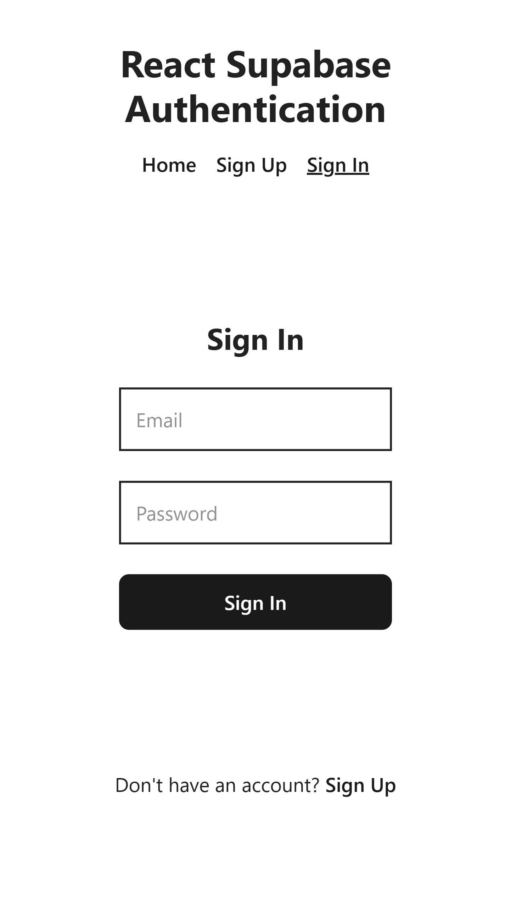
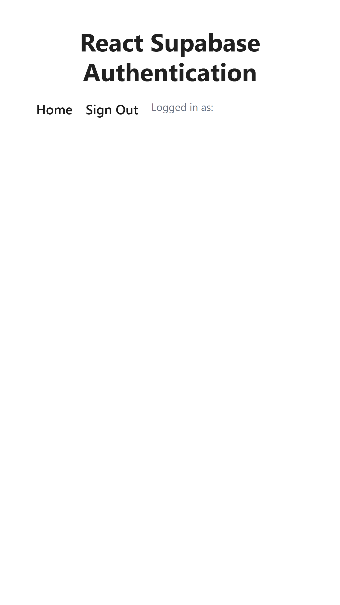

# React Supabase Auth


A simple React application demonstrating user authentication using Supabase. This project includes features for user signup, signin, and signout, along with protected routes that require authentication.


## Screenshots

Below are some screenshots of the application:

<p align="center">
   
   
</p>

## Features
- User Signup
- User Signin
- User Signout
- Protected Routes
- Context API for managing authentication state
- React Router for navigation

## Technologies Used
- React
- Supabase
- React Router
- Tailwind CSS
- Context API
- Vite

## Getting Started

### Prerequisites
- Node.js installed on your machine
- A Supabase account and project

### Installation
1. Clone the repository:
   ```bash
   git clone https://github.com/azwri/react-supabase-auth.git
   cd react-supabase-auth
   ```
2. Install dependencies:
   ```bash
   npm install
    ```
3. Set up environment variables:
   Create a `.env` file in the root directory and add your Supabase URL and Anon Key:
   ```env
   VITE_SUPABASE_URL=your_supabase_url
   VITE_SUPABASE_ANON_KEY=your_supabase_anon_key
   ```
4. Start the development server:
   ```bash
    npm run dev
    ```
5. Open your browser and navigate to `http://localhost:5173` to see the application in action.

## Folder Structure
```
react-supabase-auth/
├── public/
├── src/
│   ├── components/
│   ├── context/
│   ├── hooks/
│   ├── pages/
│   ├── App.jsx
│   └── main.jsx
├── .env
├── package.json
├── tailwind.config.js
└── vite.config.js
```

## Contributing
Contributions are welcome! Please fork the repository and create a pull request with your changes.

## License
This project is licensed under the MIT License. See the [LICENSE](LICENSE) file for details

## Acknowledgements
- [Supabase Documentation](https://supabase.com/docs)
- [React Documentation](https://reactjs.org/docs/getting-started.html)

